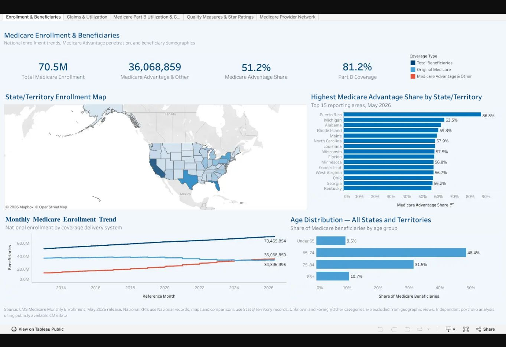
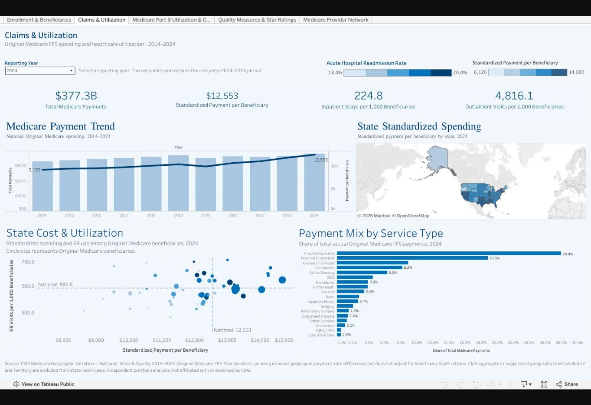
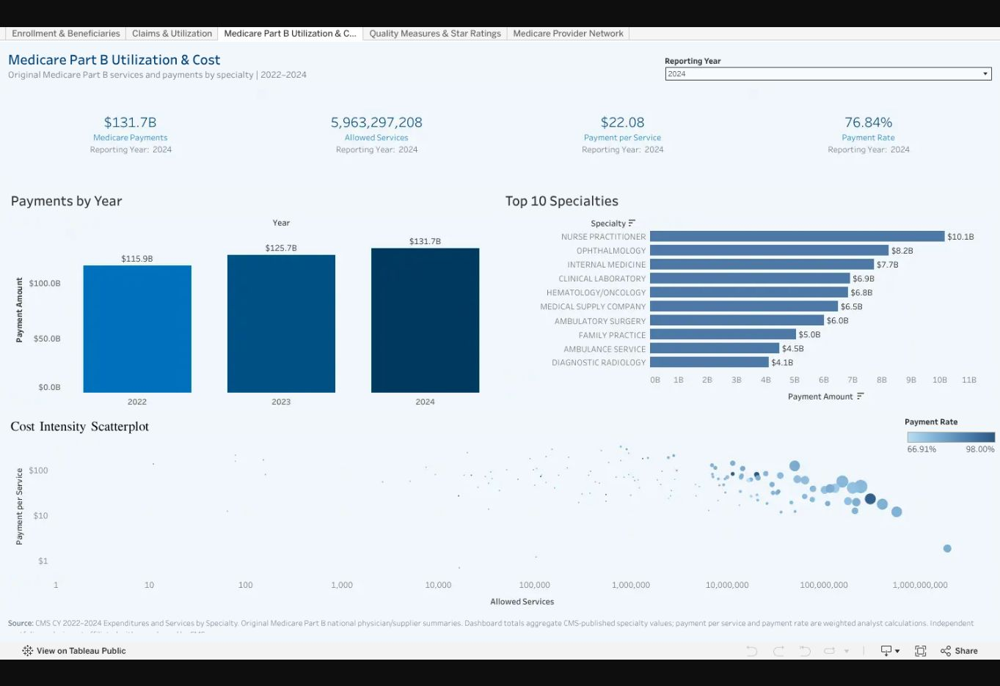
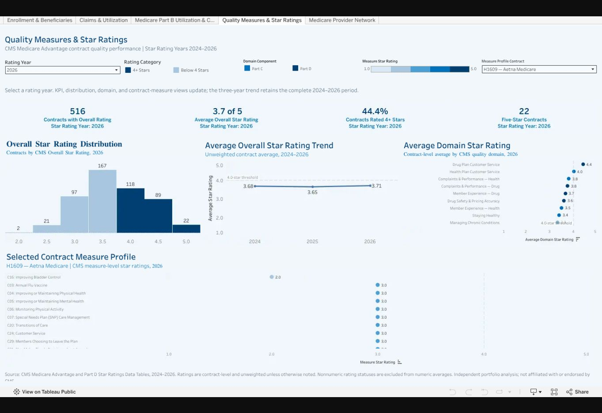
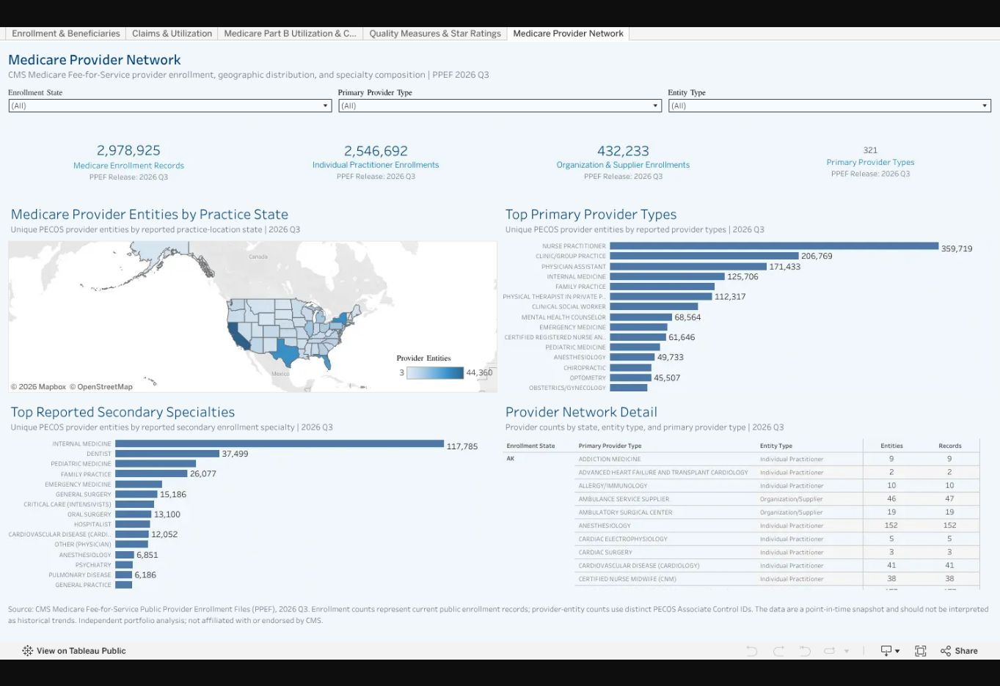

# CMS Medicare Program Analytics Portfolio

An interactive healthcare analytics portfolio examining Medicare enrollment, beneficiary demographics, claims and utilization, quality and Star Ratings, provider-network participation, and Part B utilization and cost.

## Explore the project

| Resource | What it provides |
| --- | --- |
| **[Interactive Tableau Public workbook →](https://public.tableau.com/views/CMS_Medicare_Analytics_Publication/EnrollmentBeneficiaries)** | Five dashboards with filters, parameters, tooltips, and dashboard actions |
| **[Tableau dashboard PDF](docs/CMS_Medicare_Tableau_Dashboards.pdf)** | Five landscape dashboard pages for viewing or printing |
| **[Excel data dictionary](docs/CMS_Medicare_Data_Dictionary.xlsx)** | Field definitions, units, Tableau formulas, data relationships, and source references for all five dashboards |
| **[Portfolio presentation and documentation](docs/)** | Portfolio presentation, dashboard PDF, and supporting documentation |
| **[Source data and public-use extracts](data/)** | Source workbooks and CMS public-use extracts, including instructions for reconstructing large files |
| **[Tableau workbook resources](tableau/)** | Live dashboards and the packaged Tableau workbook download (.twbx) |

> **Portfolio disclosure:** This independent portfolio project was created from public or analyst-prepared healthcare data for educational and professional demonstration purposes. It was not commissioned, sponsored, reviewed, or endorsed by CMS. It does not contain beneficiary-level records, protected health information, confidential payer data, or internal CMS systems data.

## Dashboard gallery

Click any dashboard image to open its interactive view in Tableau Public.

### 1. Enrollment & Beneficiaries

Examines monthly Medicare enrollment trends, beneficiary demographics, geographic distribution, and age-group patterns through coordinated filters and map interactions.

### 2. Claims & Utilization

Explores claim volume, service utilization, payment amounts, service-type differences, and denial indicators using standardized analytical fields to identify patterns that merit further review.

### 3. Medicare Part B Utilization & Cost

Analyzes national Medicare Part B physician and supplier expenditures and services from 2022 through 2024, with specialty rankings, payment trends, and a cost-intensity scatterplot.

### 4. Quality Measures & Star Ratings

Compares Medicare quality performance across contracts, measures, domains, and rating years using a year parameter and contract selection, while preserving the distinction between overall, domain, and measure-level results.

### 5. Medicare Provider Network

Examines organizational and individual-practitioner enrollment by state, primary provider type, and entity type, with ranked and unrestricted views for different analytical questions.

## Strategic business problem

The project addresses a practical Medicare analytics question:

**What do enrollment, utilization, quality, provider participation, and Part B cost patterns reveal about where further analysis and monitoring are needed?**

Medicare information is distributed across datasets with different reporting periods, geographic levels, and analytical grains. Decision-makers need a concise way to explore these subjects while preserving each dataset's population, scope, and measure definitions.

This portfolio addresses five business questions:

1. How are enrollment and beneficiary characteristics changing over time and across locations?
2. Where do claim volume, utilization, payments, and denial patterns warrant further review?
3. Which Part B specialties account for the greatest service volume, spending, and payment intensity?
4. How do contract-level quality results vary across measures, domains, and rating years?
5. Where are organizations and individual practitioners enrolled, and which provider types are most prevalent?

The intended audience includes healthcare analytics, Medicare operations, finance, network management, quality, compliance, and business-intelligence teams.

## Executive summary

- **Part B payments increased over the three-year period.** Medicare payments reached $131.7 billion in 2024, compared with approximately $115.9 billion in 2022, a 13.6% two-year increase. Annual growth slowed from 8.4% in 2023 to 4.8% in 2024.
- **Payment per service rose as total service volume declined.** Service volume decreased from approximately 6.14 billion services in 2023 to 5.96 billion in 2024, while payment per service reached approximately $22.08 in 2024.
- **The national payment rate remained near 77%.** Medicare paid $131.7 billion against $171.4 billion in allowed charges in 2024, a payment rate of 76.8%.
- **Specialty payment intensity varied substantially.** In the CY 2022 specialty analysis, payment per service ranged from approximately $1.71 for Pharmacy to $276.37 for Thoracic Surgery, a roughly 160-fold difference across the selected specialties.
- **Five dashboards provide complementary Medicare perspectives.** Enrollment, claims and utilization, Part B cost, quality, and provider enrollment can be explored in one workbook, with each dashboard retaining its own reporting period and analytical grain.
- **Statistical methods support descriptive interpretation.** Specialty clustering identifies groups with different volume and payment characteristics. The regression evaluates a contemporaneous accounting relationship and does not establish future predictive accuracy.

## Part B analytical findings

The following findings are reported in the project's analysis of the CMS specialty files.

| Measure or comparison | Analytical finding | Period and scope |
| --- | --- | --- |
| Total Medicare payments | Approximately $115.9 billion in 2022 and $131.7 billion in 2024; a 13.6% two-year increase | National totals, 2022–2024 |
| Annual payment growth | 8.4% in 2023 and 4.8% in 2024 | National year-over-year comparison |
| Payments and allowed charges | $131.7 billion in Medicare payments against $171.4 billion in allowed charges | National totals, 2024 |
| National payment rate | 77.3% in 2022, 77.1% in 2023, and 76.8% in 2024 | Medicare Payment ÷ Allowed Charges |
| Service volume | Peaked at approximately 6.14 billion services in 2023 and declined to approximately 5.96 billion in 2024 | National totals, 2022–2024 |
| Payment per service | Increased to approximately $22.08 in 2024 | National Medicare Payment ÷ Allowed Services |
| Top 10 specialties | Approximately $54.8 billion in combined Medicare payments | Complete CY 2022 specialty extract |
| Leading specialty | Internal Medicine ranked first with approximately $7.29 billion in payments and 175.2 million services | CY 2022 specialty ranking |
| Specialty payment intensity | Approximately $1.71 per service for Pharmacy versus $276.37 for Thoracic Surgery; roughly a 160-fold difference | Selected specialties in the CY 2022 analysis |

The latest spending increase coincided with higher payment per service and lower total service volume. These aggregate measures describe the observed pattern; the analysis does not establish causation.

### Specialty segmentation

K-means clustering was applied to specialty-level volume, payment, payment per service, and payment rate. The analysis produced three practical specialty archetypes:

| Specialty archetype | Examples | Volume and payment characteristics |
| --- | --- | --- |
| **High-Volume Commodity** | Laboratories, pharmacy, imaging, and supplies | Low unit cost and very high throughput |
| **Balanced High-Spend** | Internal medicine, family practice, nurse practitioners, and ophthalmology | Moderate unit cost at large scale |
| **Specialized High-Intensity** | Cardiac, thoracic, and neurosurgery and selected oncology services | Lower volume with high payment per service |

These clusters describe provider specialties. They do not classify individual beneficiaries, and their composition depends on feature selection, scaling, and the chosen number of clusters.

### Structural regression

A log-log regression evaluated the contemporaneous relationship between total Medicare payment, service volume, and allowed charge per service:

`ln(Payment) = 1.00 × ln(Services) + 0.99 × ln(Charge per Service)`

| Validation measure | Reported result |
| --- | --- |
| CY 2022 model R² | 0.9995 |
| 70/30 holdout R² | Approximately 1.00 |
| Median payment error | 1.9% |

This result should be interpreted as **structural validation of a contemporaneous accounting relationship**. Total payment is mathematically related to service volume, unit price, and the relatively stable payment rate. The model does not establish causation or future predictive accuracy.

## Data-model design

The workbook uses separate analytical tables because each subject area has a different grain. The dashboards are connected as a portfolio, but the underlying measures are not physically combined into one claims or beneficiary-level table.

| Subject area | Primary analytical grain | Analytical purpose |
| --- | --- | --- |
| Enrollment and Beneficiaries | Reporting period × geography × beneficiary category | Examine enrollment trends, demographic segments, and geographic distribution |
| Claims and Utilization | Year × geography × service or utilization measure | Compare activity, utilization, and payment indicators within a defined reporting scope |
| Part B Utilization and Cost | Calendar year × provider specialty | Compare national spending trends, specialty rankings, and payment intensity |
| Quality and Star Ratings | Rating year × contract × domain or measure | Preserve overall, domain, and measure-level distinctions when comparing contracts |
| Provider Network | Enrollment record × provider or organization | Examine organization and practitioner enrollment by geography and provider type |

Data preparation includes multi-source cleaning and standardization, multi-year unions and append workflows, and Tableau logical relationships that preserve source-table grain. Validation checks cover totals, filters, labels, and Top-N behavior.

Each dashboard should be interpreted using its own reporting period, population, and grain. Values from different dashboards are complementary but are not automatically comparable.

## Analytical calculations

Six core measures support the Part B utilization and cost analysis:

| Measure | Definition | Classification |
| --- | --- | --- |
| Allowed Services | Number of covered services delivered | Source measure |
| Allowed Charges | Medicare-approved amount across allowed services | Source measure |
| Medicare Payment | Amount paid by Medicare | Source measure |
| Charge per Service | Allowed Charges ÷ Allowed Services | Calculated ratio |
| Payment per Service | Medicare Payment ÷ Allowed Services | Calculated ratio |
| Payment Rate | Medicare Payment ÷ Allowed Charges | Calculated ratio |

The analysis distinguishes reported values, calculated measures, and analytical interpretation. High total payment, high service volume, and high payment per service answer different business questions.

## Five-dashboard Tableau design

| Dashboard | Business question | Primary content |
| --- | --- | --- |
| Enrollment & Beneficiaries | How is Medicare enrollment distributed and changing? | Enrollment trends, beneficiary demographics, geography, age distribution, coordinated filters, and map interactions |
| Claims & Utilization | What patterns appear in claim volume, service use, and payments? | Claim counts, utilization, payment amounts, service categories, and denial indicators |
| Medicare Part B Utilization & Cost | Which specialties drive national Part B services and payments? | KPI tiles, three-year payment trend, dynamic specialty ranking, cost-intensity scatterplot, year and specialty controls, and click-to-filter actions |
| Quality Measures & Star Ratings | How do Medicare contracts perform across quality measures and rating years? | Overall ratings, measure stars, domain performance, contract comparison, a year parameter, and contract selection |
| Medicare Provider Network | Where and how are Medicare providers enrolled? | Organization and individual-practitioner enrollment, provider types, entity types, geography, and ranked and unrestricted views |

Top-N restrictions are applied to the relevant provider ranking worksheets while unrestricted views retain all categories. Source-specific reporting dates and refresh periods should remain visible so the portfolio does not imply that every subject area updates simultaneously.

## Executive recommendations

| Priority | Recommendation | Analytical basis | What must still be validated |
| --- | --- | --- | --- |
| 1 | Monitor high-volume specialties separately from high-intensity specialties | Large payment totals can arise from different combinations of volume and payment per service | Reporting year and specialty scope before applying a ranking or comparison |
| 2 | Use claims and utilization indicators as screening signals | Volume, payment, and denial patterns can identify areas for further investigation | Source definitions and the meaning of unusual indicators before operational conclusions are drawn |
| 3 | Pair quality results with their rating year and measurement level | The dashboard distinguishes overall, domain, and measure stars | Comparable rating years, measurement periods, and levels for each contract comparison |
| 4 | Assess provider participation by geography and provider type | Enrollment records describe organizational and individual-practitioner participation patterns | Active practice status, acceptance of new patients, appointment availability, and service volume |
| 5 | Track source-specific refresh periods | The five subject areas use different reporting periods and release schedules | The reporting date and applicable population of each dashboard before cross-dashboard interpretation |

## What is directly supported—and what is not

| Supported within the project's stated scope | Not established by this project |
| --- | --- |
| Enrollment trends and beneficiary-category summaries in the source data | Beneficiary-level claims or individual patient histories |
| Aggregate utilization and payment patterns | Clinical appropriateness, fraud, waste, or the causes of unusual activity |
| National Part B trends and specialty comparisons for the documented years | Complete specialty detail for every year or future payment forecasts |
| Contract quality and Star Ratings for defined reporting periods | Current performance beyond the source's measurement and publication periods |
| Public provider-enrollment records and geographic patterns | Active practice, appointment availability, acceptance of new patients, or patient volume |
| Descriptive specialty clusters and a structural regression relationship | Causation, patient-level segmentation, or future predictive accuracy |
| Patterns that support exploration and prioritization | Proven patient outcomes or policy effectiveness |

## Data limitations

- **Portfolio scope:** The project uses public, aggregated, or analyst-prepared data and is not a reproduction of a CMS production environment.
- **No beneficiary-level records:** The datasets do not contain beneficiary-level claims or protected health information.
- **Different analytical scopes:** Reporting periods, populations, geographies, and analytical grains vary across dashboards.
- **Public-use reporting rules:** Some CMS public-use files suppress low-volume observations or use reporting rules that can understate totals.
- **Population comparability:** Original Medicare and Medicare Advantage measures should not be combined without confirming that their populations and definitions align.
- **Enrollment and access:** Provider enrollment does not prove that a provider is actively practicing, accepting new patients, or delivering a particular volume of services.
- **Quality reporting lag:** Quality and Star Ratings reflect defined measurement periods and may lag current performance.
- **Part B specialty detail:** Specialty rankings use CY 2022 where that year provides the complete specialty-level detail in the project extract; national totals and trend measures span 2022–2024.
- **Clustering assumptions:** K-means clusters depend on feature selection, scaling, and the chosen number of clusters.
- **Regression interpretation:** The regression describes a contemporaneous accounting relationship and does not establish causation or future predictive accuracy.
- **Decision boundaries:** Dashboard results support exploration and prioritization; they do not determine clinical appropriateness, fraud, waste, patient outcomes, or policy effectiveness.

## Public data sources

| Subject area | Official source | Release or reporting period used |
| --- | --- | --- |
| Enrollment and Beneficiaries | [Medicare Monthly Enrollment](https://data.cms.gov/summary-statistics-on-beneficiary-enrollment/medicare-enrollment/medicare-monthly-enrollment) | May 2026 |
| Claims and Utilization | [Medicare Geographic Variation – by National, State & County](https://data.cms.gov/summary-statistics-on-use-and-payments/medicare-geographic-comparisons/medicare-geographic-variation-by-national-state-county) | Data years 2014–2024 |
| Part B Utilization and Cost | Expenditures and Services by Specialty: [CY 2022](https://www.cms.gov/files/document/cy-2022-expenditures-and-services-specialty.xlsx), [CY 2023](https://www.cms.gov/files/document/cy-2023-expenditures-and-services-specialty.xlsx), and [CY 2024](https://www.cms.gov/files/document/cy-2024-expenditures-and-services-specialty.xlsx) | Calendar years 2022–2024 |
| Quality and Star Ratings | [Part C and D Performance Data](https://www.cms.gov/medicare/health-drug-plans/part-c-d-performance-data) | 2024–2026 Star Ratings files |
| Provider Network | [Medicare Fee-for-Service Public Provider Enrollment](https://data.cms.gov/provider-characteristics/medicare-provider-supplier-enrollment/medicare-fee-for-service-public-provider-enrollment) | Q3 2026 |

## Repository contents

| Location | Contents |
| --- | --- |
| `README.md` | Project overview, dashboard gallery, analytical findings, methods, sources, and limitations |
| `assets/` | Five dashboard preview images used in the gallery |
| **[data](data/)** | Source workbooks and CMS public-use extracts, including instructions for reconstructing large files |
| **[docs](docs/)** | Portfolio presentation, dashboard PDF, and supporting documentation |
| **[tableau](tableau/)** | Live dashboards and the packaged Tableau workbook download (.twbx) |

## Skills demonstrated

- Medicare enrollment, beneficiary demographics, and geographic analysis
- Claims normalization, utilization metrics, payment analysis, and service-category comparison
- Multi-source data cleaning, standardization, multi-year unions, and append workflows
- Tableau logical relationship modeling across different analytical grains
- KPI development, calculated fields, parameters, dynamic filters, dashboard actions, and drill-down design
- Time-series, ranking, distribution, and cost-intensity analysis
- Contract benchmarking, quality-domain comparison, and measure-level drill-down
- Provider-data integration, entity classification, cross-source relationships, and Top-N design
- Descriptive segmentation using K-means clustering
- Log-log regression with holdout validation and explicit interpretation limits
- Validation of totals, filters, labels, and dashboard behavior
- Executive synthesis, recommendation development, and transparent communication of assumptions and limitations

The portfolio demonstrates the ability to translate Medicare business questions into measurable requirements, prepare and relate datasets without duplicating measures, and build reusable decision-support tools for enrollment, claims, quality, providers, and cost.

## Technologies

| Area | Tools and methods |
| --- | --- |
| Data preparation | Excel and Power Query |
| Visualization | Tableau Desktop and Tableau Public |
| Analysis | KPI development, trend analysis, geographic analysis, ranking, segmentation, and regression |
| Data | CMS public-use Medicare enrollment, utilization, quality, provider-enrollment, and Part B specialty sources |

## Appropriate use

This work is suitable as a healthcare analytics portfolio demonstration and as a starting point for further analysis. Operational interpretation should retain each source's reporting period, population, grain, and measure definitions. Findings support exploration and prioritization, with further validation needed before drawing conclusions about access, clinical appropriateness, unusual activity, patient outcomes, or policy effectiveness.
